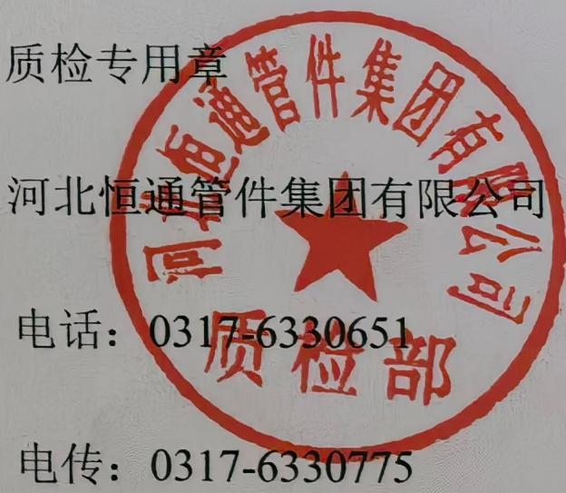

HENGTONG

## 产品质量证明书

JL/ZJ-25

物料编码：4709040088544236

收货单位：中国石油化工股份有限公司安庆分公司

<table><tr><td colspan="2">产品名称</td><td colspan="5">有缝弯头90°</td><td colspan="3">材质</td><td colspan="5">Q245R GB713</td></tr><tr><td colspan="2">规格型号</td><td colspan="5">DN1000×12 R=1.5D</td><td colspan="3">数量</td><td colspan="5">3</td></tr><tr><td colspan="15">原材料</td></tr><tr><td>牌号</td><td colspan="2">Q245R</td><td>规格</td><td colspan="2">14*2500*12000</td><td colspan="2">标准</td><td colspan="3">GB/T713-2014</td><td colspan="4">材料来源</td></tr><tr><td>炉号</td><td colspan="2">231669400</td><td>批号</td><td colspan="2">23S-043902</td><td colspan="2">供货状态</td><td colspan="3">热轧</td><td colspan="4">山东钢铁集团日照有限公司</td></tr><tr><td colspan="15">化学成分(%)</td></tr><tr><td>项目类别</td><td colspan="2">C</td><td>Si</td><td>Mn</td><td>S</td><td colspan="2">P</td><td>Cr</td><td>Ni</td><td>Cu</td><td>Ti</td><td>Mo</td><td colspan="2">V</td></tr><tr><td>原始单值</td><td colspan="2">0.18</td><td>0.18</td><td>0.67</td><td>0.002</td><td colspan="2">0.019</td><td>0.020</td><td>0.010</td><td>0.010</td><td>0.003</td><td>0</td><td colspan="2">0.005</td></tr><tr><td>厂复检值</td><td colspan="2">0.19</td><td>0.17</td><td>0.69</td><td>0.003</td><td colspan="2">0.018</td><td>0.021</td><td>0.011</td><td>0.012</td><td>0.003</td><td>0.001</td><td colspan="2">0.004</td></tr><tr><td colspan="15">力学性能</td></tr><tr><td>项目类别</td><td colspan="3">屈服点ReL(Mpa)</td><td colspan="3">抗拉强度Rm(Mpa)</td><td colspan="3">延伸率A(%)</td><td colspan="5">冲击功0°C A k v(J)</td></tr><tr><td>原始单值</td><td colspan="3">315</td><td colspan="3">452</td><td colspan="3">30.5</td><td>209</td><td colspan="2">213</td><td colspan="2">194</td></tr><tr><td>厂复检值</td><td colspan="3">320</td><td colspan="3">460</td><td colspan="3">31</td><td>207</td><td colspan="2">215</td><td colspan="2">196</td></tr><tr><td colspan="15">管件质量</td></tr><tr><td>力学性能</td><td colspan="2">交货状态</td><td colspan="2">硬度HBW</td><td colspan="2">外观尺寸</td><td colspan="2">RT</td><td colspan="2">UT</td><td colspan="2">MT</td><td colspan="2">PT</td></tr><tr><td>合格</td><td colspan="2">正火</td><td colspan="2">合格</td><td colspan="2">合格</td><td colspan="2">合格</td><td colspan="2">合格</td><td colspan="2">合格</td><td colspan="2">/</td></tr></table>

## 产品质量合格证

证书编号:20260625292

产品经检验符合 SH/T3408 标准规定及图样和合同要求，准予出厂。(无损检测按 NB/T47013-2015 标准检验合格)

检验员：赵舰军

质保师：李艳庆

出厂日期：2026.06.25

河北恒通管件集团有限公司

电话：0317-6330651

电传：0317-6330775

邮编：061303

录制：李宁